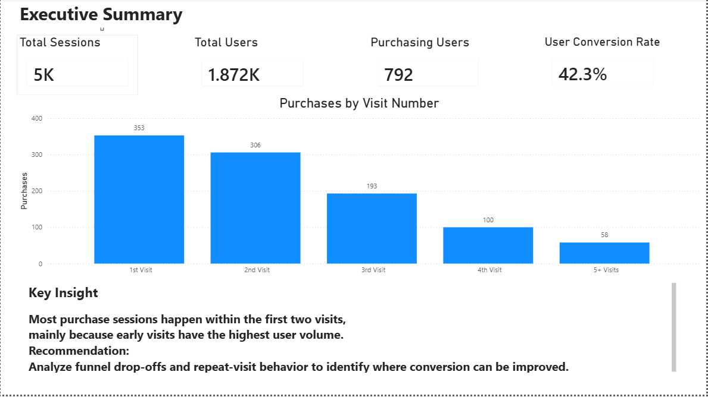
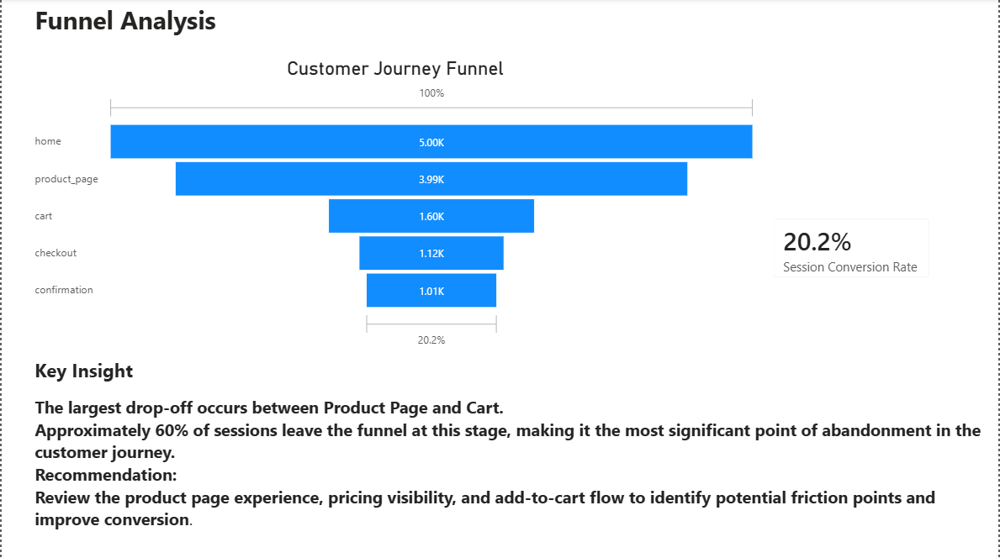
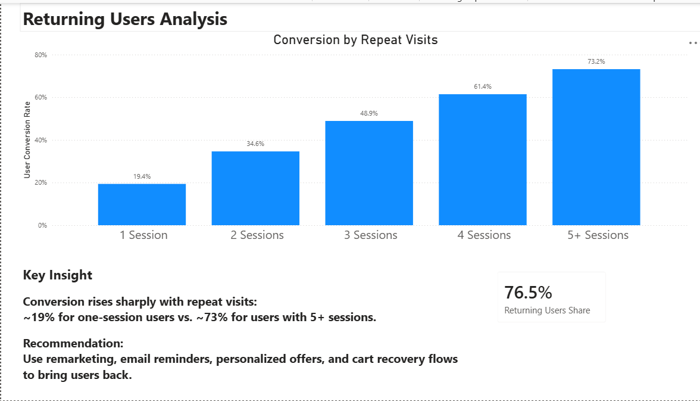

# powerbi_customer_journey_analysis
Customer Journey Analysis in Power BI – funnel analysis, conversion tracking, and repeat-user behavior insights.

# Power BI Customer Journey Analysis

## Project Overview

This project analyzes customer journey behavior using Power BI, focusing on conversion performance, funnel drop-offs, and repeat-visit behavior.

The goal was to understand how users move through the purchase journey, identify the main points of friction, and provide actionable business recommendations to improve conversion.

---

## Tools & Skills Used

- **Power BI** – dashboard creation, data visualization, page design
- **DAX** – calculated measures and conversion metrics
- **Data Analysis** – funnel analysis, user behavior analysis, KPI definition
- **Business Intelligence** – translating insights into business recommendations

---

## Dataset

The dataset contains website customer journey data, including user sessions, funnel stages, purchase behavior, and session-level attributes.

Key dataset details:

- **5,000 sessions**
- **1,872 unique users**
- **792 purchasing users**
- Funnel stages: Home → Product Page → Cart → Checkout → Confirmation
- Additional attributes: timestamp, device type, country, referral source, and purchase behavior

---

## Business Questions

The analysis focuses on three main business questions:

1. **Where do users drop off in the purchase funnel?**
2. **At which visit number do most purchase sessions occur?**
3. **How does repeat-visit behavior relate to conversion rates?**

---

## Dashboard Pages

### 1. Executive Overview

A high-level summary of user activity, purchasing users, overall user conversion rate, and purchase distribution by visit number.

---

### 2. Funnel Analysis

A funnel view of the customer journey from website entry to purchase confirmation, identifying the largest drop-off point.

---

### 3. Returning Users Analysis

An analysis of how user conversion rates change as users return for additional sessions.

---

## Key Findings

### 1. Most purchase sessions happen early in the journey

Most purchase sessions occur within the first two visits. This highlights the importance of the early customer journey, where user volume is highest and purchasing decisions often take place.

### 2. The largest funnel drop-off occurs between Product Page and Cart

The most significant point of abandonment is between the Product Page and Cart stages, where approximately **60% of sessions leave the funnel**.

### 3. Repeat visits are strongly associated with higher conversion rates

Users with more sessions show significantly higher conversion rates. Conversion rises from approximately **19% for one-session users** to approximately **73% for users with 5+ sessions**.

---

## Business Recommendations

Based on the analysis, the main recommendations are:

- Improve the **Product Page → Cart** transition by reviewing product page content, pricing visibility, and add-to-cart flow.
- Reduce friction in the early customer journey, since most purchase sessions occur within the first two visits.
- Encourage repeat visits through remarketing, email reminders, personalized offers, and cart recovery flows.
- Further analyze Product Page behavior to understand why users fail to move forward to Cart.

---

## Selected Metrics

| Metric | Value |
|---|---:|
| Total Sessions | 5,000 |
| Total Users | 1,872 |
| Purchasing Users | 792 |
| User Conversion Rate | 42.3% |
| Session Conversion Rate | 20.2% |
| Returning Users Share | 76.5% |

---

## Methodology

The project included the following steps:

1. Defined key business questions around customer journey and conversion.
2. Created DAX measures for user conversion, session conversion, purchasing users, and returning-user behavior.
3. Built a three-page Power BI dashboard focused on executive summary, funnel analysis, and repeat-visit behavior.
4. Interpreted the findings and translated them into business recommendations.

---

## Files

- [Power BI Dashboard File](Customer_Journey_Analysis.pbix)
- [Dashboard PDF Export](Customer_Journey_Analysis.pdf)

---

## Conclusion

This analysis shows that conversion improvement opportunities exist in two main areas: reducing funnel friction between Product Page and Cart, and encouraging users to return for additional visits.

The dashboard provides a clear view of customer journey performance and highlights where product, marketing, and growth teams should focus their optimization efforts.
